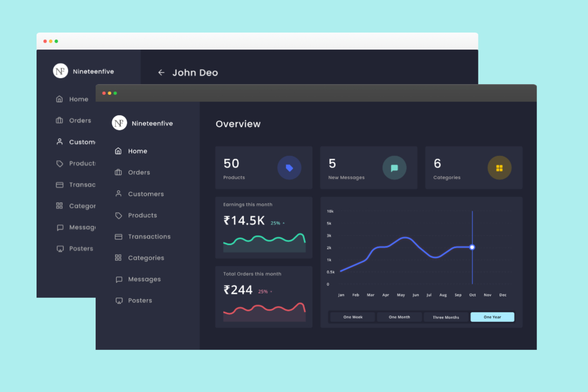
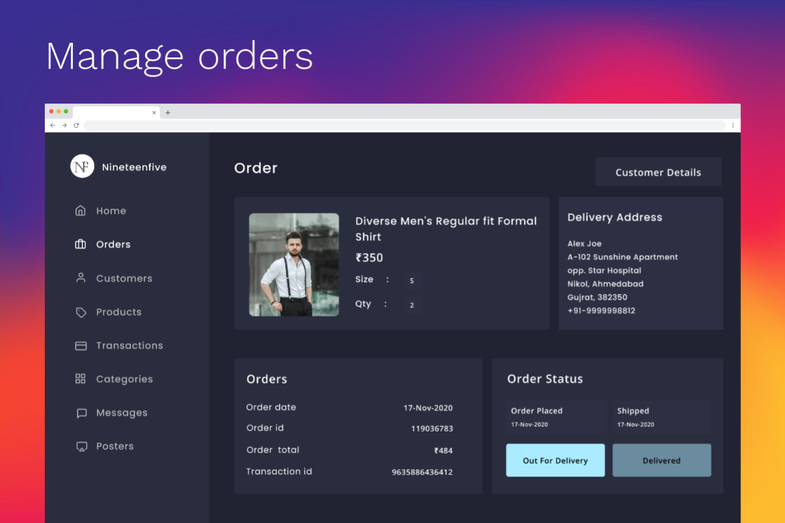

 # Nineteenfive Admin Panel

<h3 style="font-size: 18px; letter-spacing: 1.2px">SCREEN SHOTS</h3>

    
    
    
    

<h3 style="font-size: 18px; letter-spacing: 1.2px">ABOUT US</h3>

    
Nineteenfive is India’s ultimate shopping destination for clothes. Forget visiting local shop or crowed malls whenyou can get the latest fashion attire at your doorstep. For those who love fashion and dress up to look stunning in their attire when they step out in any season, Nineteenfive is your answer.

<h3 style="font-size: 18px; letter-spacing: 1.2px">FEATURES</h3>
<ol style="font-size: 16px;color: rgb(124, 122, 122);letter-spacing: 0.8px;line-height: 1.5;">
    <li>Ordered Product Details</li>   
    <li>Customer Details</li>   
    <li>Payment and Fulfilment </li>   
    <li>Add Unlimited Products</li>   
    <li>Add Unlimited Categories</li>   
    <li>Manage Products </li>   
    <li>Manage Promocodes</li>   
    <li>Manage Posters</li>   
    <li>Chat With Customers</li>   
    <li>Earnings and Orders Chart</li>
</ol>

<h3 style="font-size: 18px; letter-spacing: 1.2px">CREATED BY</h3>

[Ajaysinh Rathod](https://github.com/Ajaysinh1290)

Email : ajaysinhrathod1290@gmail.com
